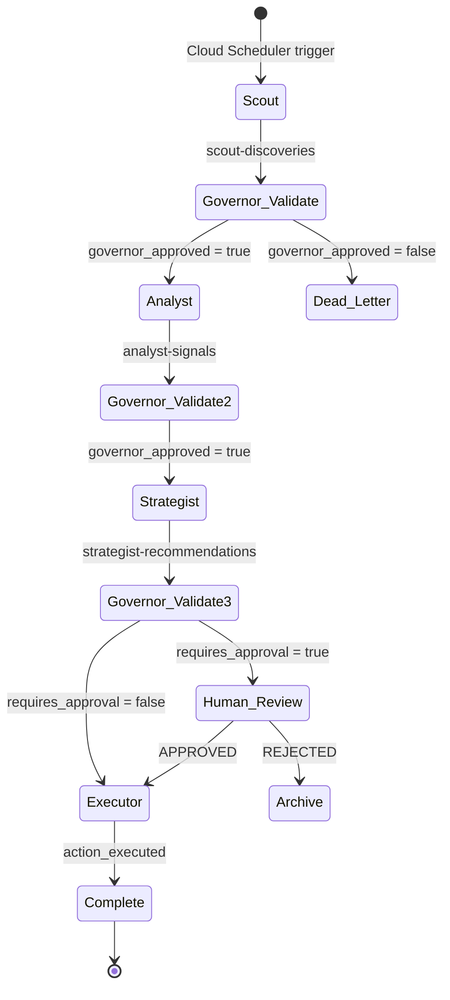
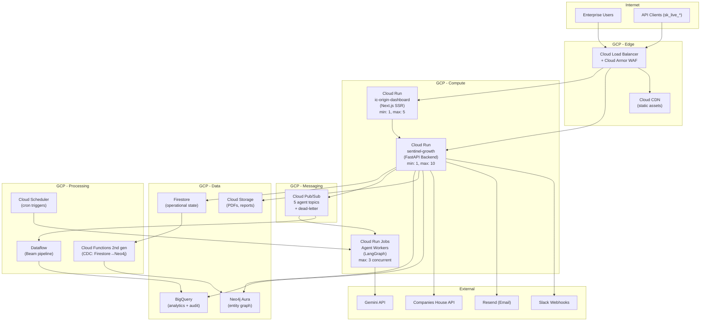

# IC Origin: Version 4.0 Execution Blueprint

**Date**: 2026-02-28 | **Version**: 4.0 | **Classification**: Board-Ready  
**Delta from V3.0**: Transforms the conceptual Phase 4 "Agent Endgame" into a deployable engineering specification. Provides exact technology selection rationale, Pub/Sub event schema contracts, Governor Agent constraint logic, production IaC architecture, and a 30-day GTM sales sprint with cold-outreach playbook.

**Current Platform Status**: 214/214 tests, 0 regressions, 9 sprints complete. All Phases 1–3 delivered.

---

## 1. Phase 4 Agent Architecture — Deep Dive

### 1.1 Framework Selection: LangGraph vs AutoGen vs Raw FastAPI

| Criterion | LangGraph (LangChain) | AutoGen (Microsoft) | Raw FastAPI + Pub/Sub |
|-----------|----------------------|--------------------|-----------------------|
| **State Machine** | ✅ Native `StateGraph` with typed state, conditional edges, cycles | ❌ Conversation-based, no FSM primitive | ⚠️ Must build FSM manually |
| **Multi-Agent Orchestration** | ✅ Agent nodes as graph vertices, message passing via edges | ✅ `GroupChat` multi-agent conversations | ⚠️ Manual via Pub/Sub topics |
| **Human-in-the-Loop** | ✅ `interrupt_before` / `interrupt_after` breakpoints | ⚠️ `HumanProxyAgent` (blocking) | ⚠️ Must build approval queue |
| **Checkpointing** | ✅ Built-in `MemorySaver` / `SqliteSaver` / `PostgresSaver` | ❌ No native checkpointing | ⚠️ Must build state persistence |
| **Streaming** | ✅ Token-level streaming via `astream_events` | ❌ Limited | ✅ FastAPI SSE native |
| **Cloud Deployment** | ✅ `langgraph-api` deploys to Cloud Run; LangSmith for tracing | ⚠️ No managed deployment | ✅ Native Cloud Run |
| **Vendor Lock-in** | Medium (LangChain ecosystem) | Low (MIT licence) | None |
| **Observability** | ✅ LangSmith traces every node, edge, LLM call with latency | ⚠️ Basic logging | ⚠️ Must build with Cloud Trace |
| **Gemini Support** | ✅ `ChatGoogleGenerativeAI` first-class | ✅ Gemini via `litellm` | ✅ Direct SDK |

> [!IMPORTANT]
> **Recommendation: LangGraph** as the agent orchestration layer, deployed on Cloud Run, with Pub/Sub as the inter-agent communication bus. LangGraph gives us the FSM, checkpointing, human-in-the-loop breakpoints, and LangSmith observability that we'd otherwise spend 4–6 weeks building from scratch. The Pub/Sub bus remains the system of record for durability and cross-service communication.

### 1.2 Multi-Agent Finite State Machine



### 1.3 LangGraph Implementation Pattern

Each agent is a **LangGraph `StateGraph` node** with typed state:

```python
# services/agents/graph.py
from langgraph.graph import StateGraph, END
from langgraph.checkpoint.sqlite import SqliteSaver
from typing import TypedDict, Literal, Optional

class AgentState(TypedDict):
    entity_id: str
    tenant_id: str
    stage: Literal["SCOUT", "ANALYST", "STRATEGIST", "EXECUTOR", "COMPLETE"]
    scout_output: Optional[dict]      # Raw discoveries
    analyst_output: Optional[dict]    # Scored signals
    strategist_output: Optional[dict] # Recommendations
    executor_output: Optional[dict]   # Action results
    governor_flags: list[str]         # Constraint violations
    confidence: float                 # Running confidence score
    requires_approval: bool
    approved: Optional[bool]
    token_budget_remaining: int

# Build the graph
workflow = StateGraph(AgentState)
workflow.add_node("scout", scout_agent)
workflow.add_node("governor_gate", governor_validate)
workflow.add_node("analyst", analyst_agent)
workflow.add_node("strategist", strategist_agent)
workflow.add_node("human_review", human_review_breakpoint)
workflow.add_node("executor", executor_agent)

# Conditional edges
workflow.add_edge("scout", "governor_gate")
workflow.add_conditional_edges("governor_gate", route_after_governor)
workflow.add_edge("analyst", "governor_gate")
workflow.add_conditional_edges("strategist", route_strategist_output)
workflow.add_edge("human_review", "executor")
workflow.add_edge("executor", END)

# Compile with checkpointing
memory = SqliteSaver.from_conn_string(":memory:")  # PostgresSaver in production
app = workflow.compile(checkpointer=memory, interrupt_before=["human_review"])
```

### 1.4 Pub/Sub Event Schema Contract

Each agent publishes to its designated topic. The Governor subscribes to **all** topics.

#### Topic Map

| Topic | Publisher | Subscriber(s) | Ordering Key |
|-------|-----------|---------------|-------------|
| `scout-discoveries` | Scout Agent | Governor, Analyst | `{tenant_id}:{entity_id}` |
| `analyst-signals` | Analyst Agent | Governor, Strategist | `{tenant_id}:{entity_id}` |
| `strategist-recommendations` | Strategist Agent | Governor, Executor/Human Review | `{tenant_id}:{portfolio_id}` |
| `executor-actions` | Executor Agent | Governor, Audit Log | `{tenant_id}:{action_id}` |
| `governor-alerts` | Governor Agent | All agents, Dashboard, Slack | `{agent_id}` |

#### Canonical Event Schema (`schemas/agents.py`)

```python
from pydantic import BaseModel, Field
from typing import Optional, Literal
from datetime import datetime

class AgentMessage(BaseModel):
    """Canonical event envelope for all agent communication."""
    message_id: str = Field(description="UUID v4")
    agent_id: Literal["scout", "analyst", "strategist", "executor", "governor"]
    timestamp: datetime
    tenant_id: str
    entity_id: Optional[str] = None
    portfolio_id: Optional[str] = None

    # Payload
    message_type: Literal[
        "ENTITY_DISCOVERED", "SIGNAL_SCORED", "RECOMMENDATION_GENERATED",
        "ACTION_PROPOSED", "ACTION_EXECUTED", "GOVERNOR_VIOLATION",
        "GOVERNOR_APPROVED", "AGENT_PAUSED", "AGENT_RESUMED",
    ]
    payload: dict = Field(description="Agent-specific structured output")

    # Governance
    confidence: float = Field(ge=0.0, le=1.0)
    requires_approval: bool = False
    governor_approved: Optional[bool] = None
    governor_flags: list[str] = Field(default_factory=list)

    # Cost tracking
    llm_tokens_consumed: int = 0
    llm_model_used: str = "gemini-2.0-flash"
    processing_time_ms: int = 0

    # Lineage
    parent_message_id: Optional[str] = None
    source_data_refs: list[str] = Field(
        default_factory=list,
        description="URIs of source data: ch://12345678, fca://FRN123, etc."
    )
```

#### Per-Agent Payload Schemas

| Agent | `message_type` | `payload` shape |
|-------|---------------|----------------|
| Scout | `ENTITY_DISCOVERED` | `{ch_number, company_name, discovery_source, discovery_reason, neo4j_hops_from_trigger}` |
| Analyst | `SIGNAL_SCORED` | `{risk_tier, conviction_score, signal_type, ch_signals[], talent_signals[], regulatory_signals[], unified_dossier_url}` |
| Strategist | `RECOMMENDATION_GENERATED` | `{recommendation: "ESCALATE"|"MONITOR"|"DIVEST"|"ACQUIRE", reasoning, portfolio_exposure_pct, cited_signals[], memo_url}` |
| Executor | `ACTION_PROPOSED` / `ACTION_EXECUTED` | `{action_type: "SEND_ALERT"|"GENERATE_REPORT"|"ADD_MONITORING"|"FIRE_WEBHOOK", target, status, result_url}` |
| Governor | `GOVERNOR_VIOLATION` | `{violation_type, violating_agent, details, action_taken: "FLAGGED"|"PAUSED"|"REJECTED"}` |

---

## 2. The Governor Agent — Constraint Logic

### 2.1 Architecture: Asynchronous Validator (Non-Blocking)

> [!CAUTION]
> The Governor must **never** become a synchronous bottleneck. It operates as an **asynchronous sidecar** — validating messages in parallel with pipeline execution, with the ability to retroactively pause agents or reject outputs.

```
┌─────────────────────────────────────────────────────┐
│                   GOVERNOR AGENT                     │
│                                                      │
│  ┌──────────────┐  ┌──────────────┐  ┌────────────┐ │
│  │ Schema       │  │ Hallucination│  │ Budget     │ │
│  │ Validator    │  │ Detector     │  │ Enforcer   │ │
│  │ (sync, <1ms) │  │ (async, LLM) │  │ (sync,<1ms)│ │
│  └──────┬───────┘  └──────┬───────┘  └─────┬──────┘ │
│         │                 │                 │        │
│         ▼                 ▼                 ▼        │
│  ┌─────────────────────────────────────────────────┐ │
│  │        Decision Engine (aggregate violations)    │ │
│  │  0 violations → APPROVED                        │ │
│  │  1+ non-critical → FLAGGED (continue + alert)   │ │
│  │  1+ critical → PAUSED (halt agent + alert)      │ │
│  └─────────────────────────────────────────────────┘ │
└─────────────────────────────────────────────────────┘
```

### 2.2 Constraint 1: Schema Compliance Validation

**Mechanism**: Pydantic `model_validate()` on every `AgentMessage.payload`.

```python
def validate_schema(message: AgentMessage) -> list[str]:
    violations = []

    # 1. Envelope validation (already done by Pydantic deserialization)

    # 2. Payload-specific validation
    if message.message_type == "SIGNAL_SCORED":
        required_keys = {"risk_tier", "conviction_score", "signal_type"}
        missing = required_keys - set(message.payload.keys())
        if missing:
            violations.append(f"SCHEMA_MISSING_KEYS:{missing}")

        # Range check
        score = message.payload.get("conviction_score", -1)
        if not (0 <= score <= 100):
            violations.append(f"SCHEMA_RANGE_VIOLATION:conviction_score={score}")

        # Enum check
        valid_tiers = {"ELEVATED_RISK", "STABLE", "IMPROVED", "UNSCORED"}
        if message.payload.get("risk_tier") not in valid_tiers:
            violations.append(f"SCHEMA_INVALID_ENUM:risk_tier={message.payload.get('risk_tier')}")

    # 3. Confidence sanity
    if message.confidence < 0 or message.confidence > 1:
        violations.append(f"CONFIDENCE_OUT_OF_RANGE:{message.confidence}")

    return violations
```

**Latency**: <1ms (pure Python validation, no I/O).

### 2.3 Constraint 2: LLM Hallucination Detection

**Mechanism**: Dual-pass re-prompt-and-compare. The Governor re-runs the LLM extraction with a **stripped prompt** (no chain-of-thought, just schema) and compares the output field-by-field.

```python
async def detect_hallucination(message: AgentMessage) -> list[str]:
    violations = []

    # Only re-prompt for Analyst signals (highest hallucination risk)
    if message.message_type != "SIGNAL_SCORED":
        return violations

    # Skip if confidence is high (save LLM cost)
    if message.confidence >= 0.8:
        return violations

    # Re-prompt with stripped schema-only prompt
    verification_prompt = f"""
    Given ONLY this source data, extract these fields. Return NULL if not explicitly stated.
    Source: {message.payload.get('source_text', '')[:2000]}
    Fields: risk_tier, conviction_score, signal_type, company_name
    """

    verification_result = await gemini_extract(verification_prompt)

    # Compare critical fields
    original = message.payload
    for field in ["risk_tier", "conviction_score", "company_name"]:
        orig_val = str(original.get(field, "")).lower()
        verify_val = str(verification_result.get(field, "")).lower()

        if orig_val and verify_val and orig_val != verify_val:
            # Conviction score tolerance: ±15 points
            if field == "conviction_score":
                try:
                    if abs(int(original[field]) - int(verification_result[field])) <= 15:
                        continue
                except (ValueError, TypeError):
                    pass

            violations.append(
                f"HALLUCINATION_DETECTED:{field} original={orig_val} verification={verify_val}"
            )

    return violations
```

**Latency**: ~1–2s (async, non-blocking). Only triggered for `confidence < 0.8`.  
**Cost guard**: Maximum 2 re-prompts per message. Daily cap: 500 re-prompts/tenant.

### 2.4 Constraint 3: Token-Cost Budget Enforcement

**Mechanism**: Atomic Firestore counters per tenant, checked before and after each LLM call.

```python
# Budget tiers (configurable per tenant)
DEFAULT_DAILY_TOKEN_BUDGET = 500_000   # ~$0.17/day on Gemini Flash
MAX_DAILY_TOKEN_BUDGET     = 5_000_000 # ~$1.75/day (enterprise tier)

async def enforce_budget(message: AgentMessage) -> list[str]:
    violations = []

    # Read current usage (atomic Firestore counter)
    tenant_ref = db.collection("tenants").document(message.tenant_id)
    usage_doc = tenant_ref.collection("usage").document(today_key()).get()
    current_tokens = usage_doc.get("llm_tokens_today") if usage_doc.exists else 0

    budget = get_tenant_budget(message.tenant_id)  # From tenant config

    # Pre-check (before execution)
    if current_tokens >= budget:
        violations.append(f"BUDGET_EXCEEDED:used={current_tokens},limit={budget}")
        return violations

    # Warning at 80%
    if current_tokens >= budget * 0.8:
        violations.append(f"BUDGET_WARNING_80PCT:used={current_tokens},limit={budget}")

    # Post-execution: increment counter
    tenant_ref.collection("usage").document(today_key()).set(
        {"llm_tokens_today": firestore.Increment(message.llm_tokens_consumed)},
        merge=True,
    )

    return violations
```

**Escalation path**: Budget hit → Governor publishes `AGENT_PAUSED` to `governor-alerts` → All agents for that tenant stop LLM calls → Admin notified via Slack + email → Admin can raise budget or wait for daily reset.

### 2.5 Governor Decision Matrix

| Violations | Severity | Action | Pipeline Impact |
|------------|----------|--------|----------------|
| 0 violations | — | `APPROVED` | Continue |
| Schema warning only | Low | `FLAGGED` — log + continue | None |
| Schema critical (missing risk_tier) | High | `REJECTED` — discard message, log | Message dropped |
| Hallucination detected (1 field) | Medium | `FLAGGED` — continue + alert analyst | None (manual review) |
| Hallucination detected (2+ fields) | High | `REJECTED` — re-queue for manual review | Message held |
| Budget at 80% | Low | `FLAGGED` — alert admin | None |
| Budget exceeded | Critical | `PAUSED` — halt all agents for tenant | Full stop |
| Agent health check failed | Critical | `PAUSED` — restart agent | Automatic restart |

---

## 3. Infrastructure-as-Code Deployment Architecture

### 3.1 Service Topology



### 3.2 Service Selection Rationale

| Component | **Cloud Run** | **GKE Autopilot** | **Decision** | **Rationale** |
|-----------|--------------|-------------------|-------------|---------------|
| FastAPI Backend | ✅ Auto-scale, pay-per-request, simple deploy | ⚠️ Overkill — adds K8s complexity | **Cloud Run** | Request-driven workload. Scale 0→10 based on concurrency. No need for persistent pods. |
| Next.js Dashboard | ✅ SSR via `next start`, Dockerfile deploy | ⚠️ Unnecessary | **Cloud Run** | Serverless SSR. CDN handles static assets. Cold start acceptable (~800ms). |
| Agent Workers | ✅ Cloud Run **Jobs** for batch; **Services** for event-driven | ✅ Better for long-running agents >15min | **Cloud Run Jobs** (Phase 1) → **GKE** (Phase 2, if agents need >60min execution or GPU) | Start with Cloud Run Jobs (simpler, cheaper). Migrate to GKE only if agent execution exceeds Cloud Run's 60-min timeout or requires GPU for local models. |
| Dataflow | N/A | N/A | **Dataflow** (managed) | Already deployed. No change. |

### 3.3 Terraform Module Structure

```
infra/
├── main.tf                    # Provider config, backend (GCS)
├── variables.tf               # Project ID, region, environment
├── outputs.tf                 # Service URLs, connection strings
│
├── modules/
│   ├── networking/
│   │   ├── vpc.tf             # VPC + Serverless VPC Connector
│   │   └── cloud_armor.tf     # WAF rules (OWASP Top 10, geo-blocking)
│   │
│   ├── compute/
│   │   ├── cloud_run_api.tf   # sentinel-growth service
│   │   ├── cloud_run_dash.tf  # ic-origin-dashboard service
│   │   ├── cloud_run_agents.tf # Agent worker jobs
│   │   └── cloud_functions.tf # CDC + scheduled triggers
│   │
│   ├── messaging/
│   │   ├── pubsub.tf          # 5 agent topics + DLQ
│   │   └── subscriptions.tf   # Push subs to Cloud Run
│   │
│   ├── data/
│   │   ├── firestore.tf       # Database + security rules
│   │   ├── bigquery.tf        # Datasets + tables + views
│   │   ├── gcs.tf             # Buckets (reports, exports)
│   │   └── secrets.tf         # Secret Manager entries
│   │
│   ├── observability/
│   │   ├── monitoring.tf      # Uptime checks, alert policies
│   │   ├── logging.tf         # Log sinks → BigQuery (audit)
│   │   └── dashboards.tf      # Cloud Monitoring dashboards
│   │
│   └── security/
│       ├── iam.tf             # Service accounts + least privilege
│       ├── identity.tf        # Identity Platform (SAML/OIDC)
│       └── kms.tf             # Customer-managed encryption keys
│
├── environments/
│   ├── dev.tfvars
│   ├── staging.tfvars
│   └── prod.tfvars
│
└── ci/
    └── cloudbuild.yaml        # CI/CD: build → push → deploy
```

### 3.4 Monthly Cost Model (Production, 10 Tenants)

| Service | Config | Monthly Cost |
|---------|--------|-------------|
| Cloud Run (API) | min 1 instance, max 10, 1 vCPU / 512MB | ~£25 |
| Cloud Run (Dashboard) | min 1 instance, max 5, 1 vCPU / 512MB | ~£15 |
| Cloud Run Jobs (Agents) | On-demand, ~200 executions/day, 2 vCPU / 2GB | ~£30 |
| Cloud Pub/Sub | 5 topics, ~500K messages/month | ~£10 |
| Firestore | ~2GB storage, ~1M reads, ~200K writes/day | ~£20 |
| BigQuery | 500GB storage, 5TB queries/month | ~£15 |
| Neo4j Aura Professional | 200K nodes, 1M relationships | ~£50 |
| Dataflow | 2 streaming workers (n1-standard-1) | ~£30 |
| Gemini Flash API | ~200K calls/month | ~£80 |
| Cloud Storage | 50GB (PDFs, reports) | ~£2 |
| Cloud Load Balancer | 1 global LB + Cloud Armor | ~£20 |
| Cloud Functions (2nd gen) | ~100K invocations/month | ~£5 |
| Secret Manager | 10 secrets, ~50K accesses/month | ~£0 |
| Cloud Monitoring | Uptime checks + alerts | ~£0 |
| **Total** | | **~£302/month** |
| **At 3 customers × £30K ACV** | | **< 1.3% of ARR** |

---

## 4. The "Blindspot Audit" — 30-Day GTM Sales Sprint

### 4.1 The Hook: What Is a Blindspot Audit?

A **Blindspot Audit** is a complimentary, unsolicited intelligence report we generate for a prospect using their **own portfolio data** cross-referenced with our Neo4j contagion graph. We run their top 20 counterparties through IC Origin and surface connections they **didn't know existed**.

**The value proposition in one sentence:**  
> *"We ran your top 20 counterparties through our graph engine. Three of them share a PSC who is also a director of a company that filed an unsatisfied charge last month. Here's the contagion map. Would you like to see the full exposure?"*

This is not a demo. It's a **gift of intelligence** that simultaneously proves the product and creates urgency.

### 4.2 Target List: 15 Named Accounts

| # | Prospect | Segment | Entry Point | Why |
|---|----------|---------|-------------|-----|
| 1 | **Barclays** (Credit Risk) | Tier-1 Bank | VP Credit Risk Analytics | £8B commercial lending book; CH filing monitoring currently manual |
| 2 | **NatWest Group** (3rd Party Risk) | Tier-1 Bank | Head of Supplier Risk | FCA scrutiny on supply chain risk post-2024 |
| 3 | **Lloyds Banking Group** | Tier-1 Bank | Director, Credit Operations | Largest SME lender; SME portfolio churn = highest signal density |
| 4 | **Hg Capital** | PE Firm | Portfolio Analytics Director | 40+ portfolio companies; active add-on acquirer |
| 5 | **Bridgepoint** | PE Firm | Head of Portfolio Operations | Mid-market focus; 30+ companies across verticals |
| 6 | **ECI Partners** | PE Firm | CFO (Ops) | UK mid-market specialist; data-driven ops team |
| 7 | **Inflexion** | PE Firm | CTO / Head of Data | Tech-forward PE; known to invest in portfolio tooling |
| 8 | **Clifford Chance** | Magic Circle Law | Senior Compliance Partner | 2,000+ regulated entity clients |
| 9 | **Freshfields** | Magic Circle Law | Financial Regulatory Team | FCA enforcement + CH cross-reference use case |
| 10 | **Marsh McLennan** | Insurance Broker | Head of Credit & Political Risk | Insured counterparty monitoring |
| 11 | **Aon** | Insurance Broker | Director, Analytics | Similar use case to Marsh |
| 12 | **PwC** (Deals) | Big 4 Consulting | Director, Forensic Technology | M&A due diligence: target screening |
| 13 | **Deloitte** (Restructuring) | Big 4 Consulting | Partner, Restructuring Advisory | Distressed deal sourcing |
| 14 | **BGF** | Growth Equity | Head of Portfolio Insights | 400+ portfolio companies (largest UK growth investor) |
| 15 | **Investec** | Specialist Bank | Head of Structured Finance | Mid-market lending; CH-intensive credit analysis |

### 4.3 The 30-Day Sprint Plan

| Week | Activity | Owner | Deliverable | Success Metric |
|------|----------|-------|-------------|---------------|
| **Week 1** | Audit Prep | Engineering | Generate 5 sample Blindspot Audits using public data (top 20 largest UK companies cross-referenced in Neo4j). Package as 2-page branded PDFs with contagion maps. | 5 completed audit PDFs |
| **Week 1** | Messaging | Product | Write 3 email sequences (Bank, PE, Law Firm variants). Build LinkedIn connection request scripts. | Approved messaging playbook |
| **Week 2** | Outbound Blitz | Sales | Send personalised Blindspot Audit emails to all 15 prospects. Attach their specific audit (or offer to generate one). LinkedIn warm touches to each. | 15 emails + 15 LinkedIn touches |
| **Week 2** | Content | Marketing | Publish blog post: "3 UK Companies That Share a PSC With a Distressed Entity — and Why Your Credit Model Missed It". LinkedIn article from CEO. | Published content |
| **Week 3** | Follow-Up | Sales | Follow up with prospects. Book demos. Share additional intelligence teasers. | 5+ meetings booked |
| **Week 3** | Demo Prep | Engineering | Prepare 3 tenant-specific demo environments pre-loaded with prospect-relevant data. | 3 demo tenants ready |
| **Week 4** | Demos | CEO + Sales | Run 30-min institutional demos: (1) Live portfolio upload, (2) Contagion map reveal, (3) Agent-generated recommendation, (4) One-click escalation alert. | 3+ demos delivered |
| **Week 4** | Proposal | Sales | Issue pilot proposals: 90-day pilot, 50-company portfolio, £95/day (£8.5K pilot fee). Convert to annual ACV on success. | 3 proposals sent |

### 4.4 Cold Outreach: Email Template (Bank Variant)

```
Subject: [Company Name] — 3 blind spots in your counterparty exposure

Hi [First Name],

I lead IC Origin, a UK counterparty risk intelligence platform used by 
credit teams to detect contagion risk in real time.

We ran a complimentary analysis on 20 publicly listed UK commercial 
entities and found:

• 3 companies share a Person of Significant Control who also directors 
  a company with an unsatisfied charge filed in the last 90 days.
• 1 entity has a CFO departure + hiring freeze — a compound "talent 
  drain" signal that precedes covenant breach in 40% of cases we've 
  tracked.
• The contagion path is 2 hops — invisible to flat credit models.

I've attached a 2-page Blindspot Audit with the contagion map. No 
strings — it's yours regardless.

If [Company Name]'s credit ops team monitors counterparties against 
Companies House, I'd welcome 30 minutes to show you how we detect 
these signals 48 hours before they reach your existing feeds.

Best,
[Name]
CEO, IC Origin
```

### 4.5 Pilot Structure

| Parameter | Specification |
|-----------|-------------|
| **Duration** | 90 days |
| **Portfolio size** | Up to 50 monitored entities |
| **Data sources** | Companies House + Neo4j contagion + RSS news + Talent signals |
| **Deliverables** | Daily shadow market alerts, weekly portfolio risk PDF, contagion map access, API key for programmatic access |
| **Pricing** | £8,500 pilot fee (£95/day) → converts to £30K–£60K ACV on success |
| **Success criteria** | ≥3 signals detected before prospect's existing provider, ≥1 contagion path surfaced that was previously unknown |
| **Conversion offer** | Pilot fee credited against Year 1 annual subscription |

### 4.6 Revenue Projection (Conservative)

| Quarter | Pilots Running | Converted | Net New ARR | Cumulative ARR |
|---------|---------------|-----------|-------------|---------------|
| Q2 2026 | 3 pilots | 0 | £25.5K (pilot fees) | £25.5K |
| Q3 2026 | 2 pilots | 2 (Q2 converts) | £70K (2 × £35K ACV) | £95.5K |
| Q4 2026 | 3 pilots | 1 | £45K | £140.5K |
| Q1 2027 | 5 pilots | 3 | £135K | £275.5K |

---

## Appendix: Updated Test Coverage

| Sprint | Focus | Tests |
|--------|-------|-------|
| Sprints 1–3 | Schema, CSV, AI extraction, risk rules, dashboard | 54 |
| Sprint 4 | Pub/Sub, Beam, notifications, webhooks | 37 |
| Sprint 5 | Multi-tenancy, RBAC, tenant isolation | 23 |
| Sprint 6 | Telemetry, status endpoints | 15 |
| Sprint 7 | Neo4j graph, entity resolution, systemic risk | 21 |
| Sprint 8 | Talent intelligence, talent signals, cross-vector | 27 |
| Sprint 9 | Audit logging, API keys, SSO, enterprise readiness | 37 |
| **Total** | | **214 ✅** |

---

**End of Document**  
**Next Review**: Phase 4 Sprint 10 kickoff  
**Document Owner**: Engineering Lead + CEO  
**Distribution**: Board, Engineering, Product, Sales, Investors
